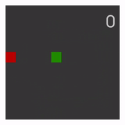
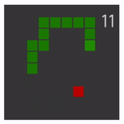
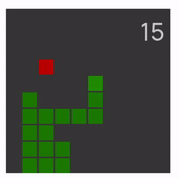
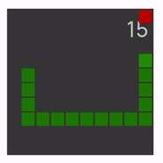
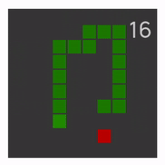
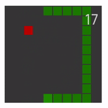

# SnakeAI

SnakeAI is the AI experimentation for Snake game that was implemented in Unity engine.

# AI List

- Traditional
  - [Version 1](#####version-1)
  - [Version 2](#####version-2)
- Machine Learning (Reinforcement Learning)
  - [ML1](#####ML1)
  - [ML2](#####ML2)
  - [ML3](#####ML3)
  - [ML4](#####ML4)
  - [ML5](#####ML5)
  - [ML6](#####ML6)

# Experimentation

### Traditional AI

- ##### ML1Version 1

  

  | Name                  | Description                                          |
  | --------------------- | ---------------------------------------------------- |
  | Condition             | - Finding food directions (Random if more than one ) |
  | Board size limitation | unlimited                                            |

- ##### Version 2

  

  | Name                  | Description                                                  |
  | --------------------- | ------------------------------------------------------------ |
  | Condition             | - Same as `Version1` - Removing non-moveable direction for direction set    (both food and non-food direction set) - Calculating game over for a next turn     then remove it from the direction set |
  | Board size limitation | unlimited                                                    |

### Machine Learning

- ##### ML1

  

  | Name       | Description                          |
  | ---------- | ------------------------------------ |
  | Action     | Up, Down, Left, Right                |
  | State      | - Food position - Head position |
  | Config     | - Default                            |
  | Limitation | -                                    |

- ##### ML2

  

  | Name       | Description                                                  |
  | ---------- | ------------------------------------------------------------ |
  | Action     | Up, Down, Left, Right                                        |
  | State      | - **2x** Food position - **2x** Head position - **100x** All of block type (Zero, Positive and Negative) |
  | Config     | - Default                                                    |
  | Limitation | 10x10 board size only                                        |

- ##### ML3

  

  | Name       | Description                                                  |
  | ---------- | ------------------------------------------------------------ |
  | Action     | Up, Down, Left, Right                                        |
  | State      | - **2x** Food position - **2x** Head position - **100x** All of block type (Zero, Positive and Negative) |
  | Config     | - Default - batch_size: 128  - buffer_size: 2048  - hidden_units: 256 |
  | Limitation | 10x10 board size only                                        |

- ##### ML4

  

  | Name       | Description                                                  |
  | ---------- | ------------------------------------------------------------ |
  | Action     | Up, Down, Left, Right                                        |
  | State      | - **2x** Food position - **2x** Head position - **100x** All of block type (Zero, Positive and Negative) - **1x** Number of tails |
  | Config     | - Default - batch_size: 128  - buffer_size: 2048  - hidden_units: 256 - beta: 1.0e-4 |
  | Limitation | **10x10** board size only                                    |

- ##### ML5

  

  | Name       | Description                                                  |
  | ---------- | ------------------------------------------------------------ |
  | Action     | Up, Down, Left, Right                                        |
  | State      | - **2x** Food position - **2x** Head position - **100x** All of block type (Zero, Positive and Negative) - **1x** Number of tails |
  | Config     | - Default - batch_size: 128  - buffer_size: 2048  - hidden_units: 256 |
  | Limitation | **10x10** board size only                                    |

- ##### ML6

  

  | Name       | Description                                                  |
  | ---------- | ------------------------------------------------------------ |
  | Action     | Up, Down, Left, Right                                        |
  | State      | - **2x** Food position - **2x** Head position - **100x** All of block type (Positive and Negative) - **1x** Number of tails - **4x** Food Direction Set - **4x** Non-Food Direction Set |
  | Config     | - Default - batch_size: 128  - buffer_size: 2048  - hidden_units: 256 |
  | Limitation | **10x10** board size only                                    |
